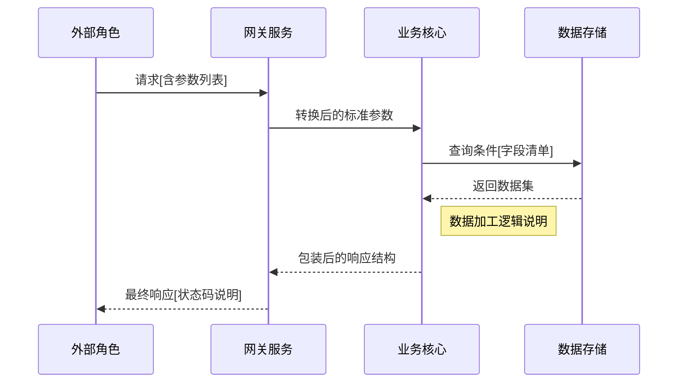

### 🔍 业务功能脉络分析（面向业务分析师）
**结构化指令：**
1. 角色识别
   - 请列出当前功能涉及的内部角色（系统模块）和外部角色（用户/第三方）
   - 区分启动方（initiator）和响应方（responder）

2. 流程分解
   - 描述完整的端到端业务流程，标注关键决策节点
   - 识别异常处理路径（错误码/分支流程）

3. 数据溯源
   - 标注每个交互节点的输入/输出数据结构
   - 标记数据存储节点（DB/缓存/第三方）

**输出要求：**

