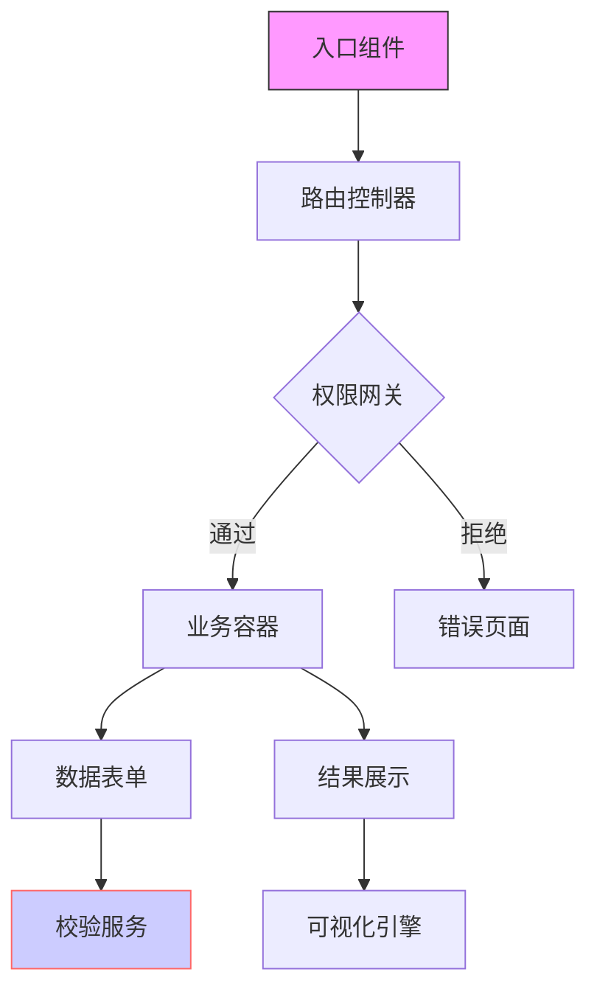

### 💻 项目代码架构解析指南

**一、代码组织结构**
1. 项目技术栈概览
   ```mermaid
   graph TD
       A[前端技术栈]
       B[后端技术栈]
       C[数据库技术栈]
       D[DevOps工具链]
       
       A --> A1[框架版本]
       A --> A2[核心依赖]
       A --> A3[构建工具]
       
       B --> B1[开发语言]
       B --> B2[框架选型]
       B --> B3[中间件]
       
       C --> C1[数据库类型]
       C --> C2[缓存方案]
       C --> C3[存储方案]
       
       D --> D1[CI/CD]
       D --> D2[监控工具]
       D --> D3[日志方案]
   ```

2. 目录结构说明
   ```
   project-root/
   ├── src/                # 源代码目录
   │   ├── api/           # API接口定义
   │   ├── components/    # 组件目录
   │   ├── services/      # 服务层
   │   ├── utils/         # 工具类
   │   └── config/        # 配置文件
   ├── tests/             # 测试用例
   ├── docs/              # 文档说明
   └── scripts/           # 构建脚本
   ```

**二、核心模块解析**
1. 关键组件依赖图
   ```mermaid
   graph TD
       A[入口模块] --> B[路由模块]
       B --> C{权限控制}
       C -->|验证通过| D[业务模块]
       C -->|验证失败| E[错误处理]
       D --> F[数据处理]
       D --> G[UI组件]
       F --> H[缓存层]
       F --> I[存储层]
       
       style A fill:#f9f,stroke:#333
       style C fill:#ff9,stroke:#333
       style F fill:#9f9,stroke:#333
   ```

2. 核心类图谱
   - 实体类关系
   - 服务类层次
   - 工具类分类

**三、关键技术实现**
1. 数据流处理
   - 状态管理方案
   - 缓存策略
   - 异步处理机制

2. 性能优化点
   - 代码层面优化
   - 资源加载优化
   - 缓存使用优化

**四、代码质量保障**
1. 代码规范
   - 命名规范
   - 注释规范
   - 目录组织规范

2. 测试策略
   - 单元测试覆盖
   - 集成测试方案
   - E2E测试计划

**五、问题排查指南**
1. 常见问题定位
   - 性能问题排查
   - 内存泄漏排查
   - 并发问题排查

2. 调试技巧
   - 日志查看方法
   - 断点调试技巧
   - 性能分析工具

**六、开发工具链**
1. 必备工具
   - IDE配置
   - 插件推荐
   - 调试工具

2. 效率提升
   - 代码片段
   - 快捷键
   - 自动化脚本

**验收标准**
1. 代码掌握
   - 理解核心模块职责
   - 掌握关键类实现
   - 熟悉常用工具类

2. 开发能力
   - 能独立开发新功能
   - 能定位修复常见问题
   - 能进行代码优化

**最佳实践**
1. 开发规范
   - 遵循代码规范
   - 编写单元测试
   - 及时代码审查

2. 性能考虑
   - 合理使用缓存
   - 优化数据库查询
   - 控制代码复杂度

### 💻 代码架构解析（面向开发人员）
**结构化指令：**
1. 架构分层
   - 区分表现层/业务层/基础设施层
   - 说明各层技术栈（框架/中间件版本）

2. 组件图谱
   - 列出父子组件关系（继承/组合）
   - 标注公共组件和业务组件

3. 通信机制
   - 说明跨组件通信方式（props/event bus/状态管理）
   - 标注接口定义（入参/出参/错误处理）

**输出要求：**


---
