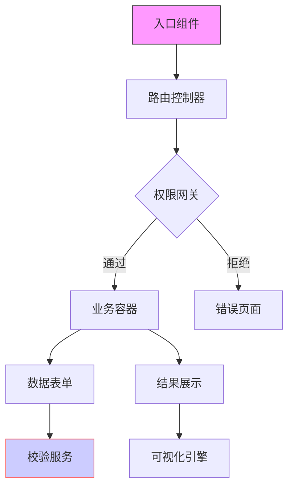

### 💻 代码架构解析（面向开发人员）
**结构化指令：**
1. 架构分层
   - 区分表现层/业务层/基础设施层
   - 说明各层技术栈（框架/中间件版本）

2. 组件图谱
   - 列出父子组件关系（继承/组合）
   - 标注公共组件和业务组件

3. 通信机制
   - 说明跨组件通信方式（props/event bus/状态管理）
   - 标注接口定义（入参/出参/错误处理）

**输出要求：**

---
