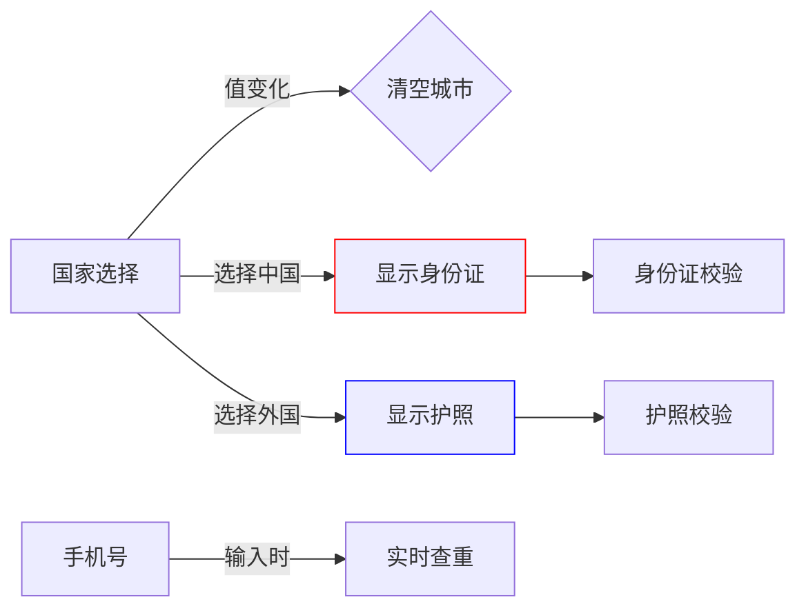

### 📑 字段依赖分析（面向实施顾问）
**结构化指令：**
1. 字段元数据
   - 列出所有字段的ID/显示名/数据类型
   - 标记必填字段和条件字段

2. 联动逻辑
   - 描述字段触发关系（监听字段->目标字段）
   - 说明触发条件（值范围/组合条件）

3. 数据溯源
   - 标注每个字段的数据来源（用户输入/接口获取/计算字段）
   - 说明异步加载机制

**输出要求：**

