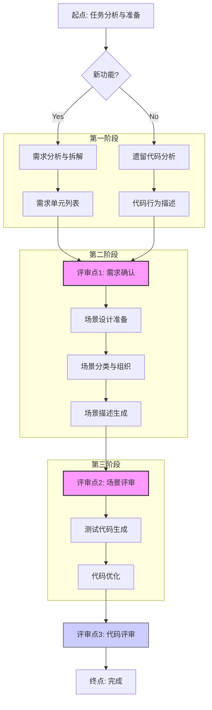

# 测试辅助指令模板使用流程 V2.0

## 核心原则

*   **系统化方法：** 每个阶段都采用系统化的方法，确保输出的完整性和质量。
*   **阶段化推进：** 按顺序执行需求分析、场景设计、代码生成。
*   **评审是关键：** 在关键节点进行人工评审，确保质量和一致性。AI 评审辅助工具用于提高效率，但不能替代人工决策。
*   **职责分离：** 每个模板专注于特定任务，根据需要选择合适的模板。
*   **持续优化：** 通过定期评审和反馈，持续优化测试场景和代码质量。

## 流程步骤

1.  **【起点】 任务分析与准备**
    *   **任务类型判断：** 
        - 新功能开发
        - 遗留代码测试补充
        - 行为理解与文档化
    *   **准备工作：**
        - 收集相关文档和代码
        - 明确质量要求
        - 识别关键干系人

2.  **【第一阶段】 需求理解与拆解**
    *   **情况 A: 新功能**
        *   **使用模板:** `新功能需求分析与拆解指令.md`
        *   **输入要求:** 
            - 产品需求文档（PRD）
            - 用户故事（User Story）
            - 业务流程描述
            - 设计稿
            - 验收标准（必需）
            - 业务规则（必需）
        *   **分析重点:**
            - 业务目标理解
            - 关键流程识别
            - 验收标准明确化
            - 约束条件识别
        *   **输出:** 结构化的需求单元列表

    *   **情况 B: 遗留代码**
        *   **使用模板:** `遗留代码理解与需求提取指令.md`
        *   **输入要求:**
            - 源代码文件/片段
            - 调用关系说明
            - 主要职责描述
            - 已知问题清单
        *   **分析重点:**
            - 代码主要职责
            - 关键逻辑流程
            - 依赖关系图
            - 错误处理机制
        *   **输出:** 代码分析报告和行为描述

3.  **【评审点 1 - 强制】 需求/行为确认评审**
    *   **评审对象:** 需求单元列表/行为描述
    *   **评审维度:**
        - 准确性：是否准确反映原始意图
        - 完整性：是否覆盖所有关键点
        - 清晰度：是否无歧义可测试
        - 一致性：是否与源保持一致
    *   **评审参与者:**
        - 产品经理
        - 业务分析师
        - 开发负责人
        - 测试负责人
    *   **评审工具:**
        - `评审辅助指令.md` (类型1)
        - 评审检查清单
        - 问题跟踪表

4.  **【第二阶段】 测试场景设计**
    *   **使用模板:** `测试场景生成指令.md`
    *   **设计准备:**
        - 需求分析
        - 上下文分析
        - 风险评估
    *   **场景分类:**
        - 功能场景
        - 异常场景
        - 边界场景
    *   **场景组织:**
        - 按流程（前置/主流程/后置）
        - 按角色（用户/系统/管理）
        - 按优先级（P0/P1/P2）
    *   **描述规范:**
        - Gherkin语法规范
        - 场景标注要求
        - 描述质量标准

5.  **【评审点 2 - 强制】 测试场景评审**
    *   **评审对象:** Gherkin测试场景
    *   **评审维度:**
        - 功能完整性
        - 描述质量
        - 技术可行性
    *   **评审清单:**
        - 核心流程覆盖
        - 异常场景完整
        - 边界条件考虑
        - 描述清晰度
        - 步骤可执行性
        - 验证点明确性
    *   **评审工具:**
        - `评审辅助指令.md` (类型2)
        - 场景评审矩阵
        - 覆盖度分析表

6.  **【第三阶段】 测试代码生成**
    *   **使用模板:** `测试代码生成指令.md`
    *   **输入要求:**
        - 评审确认的Gherkin场景
        - 测试框架规范
        - 代码规范文档
        - 数据工厂配置
        - Mock策略说明
    *   **代码质量要求:**
        - 可读性
        - 可维护性
        - 可重用性
        - 性能考虑

7.  **【评审点 3 - 标准实践】 代码评审**
    *   **评审维度:**
        - 代码正确性
        - 规范符合度
        - 测试覆盖率
        - 性能影响
    *   **最佳实践:**
        - 定期评审更新
        - 持续优化改进
        - 经验总结沉淀

## 流程图示意



## 最佳实践建议

1. **需求分析阶段：**
   * 充分理解业务目标
   * 识别所有关键流程
   * 明确验收标准
   * 考虑约束条件

2. **场景设计阶段：**
   * 系统化设计方法
   * 全面的场景覆盖
   * 清晰的描述规范
   * 注重可执行性

3. **代码生成阶段：**
   * 遵循代码规范
   * 保证代码质量
   * 考虑维护成本
   * 注重复用性

4. **持续优化：**
   * 定期评审更新
   * 收集反馈改进
   * 经验总结沉淀
   * 工具流程优化
``` 